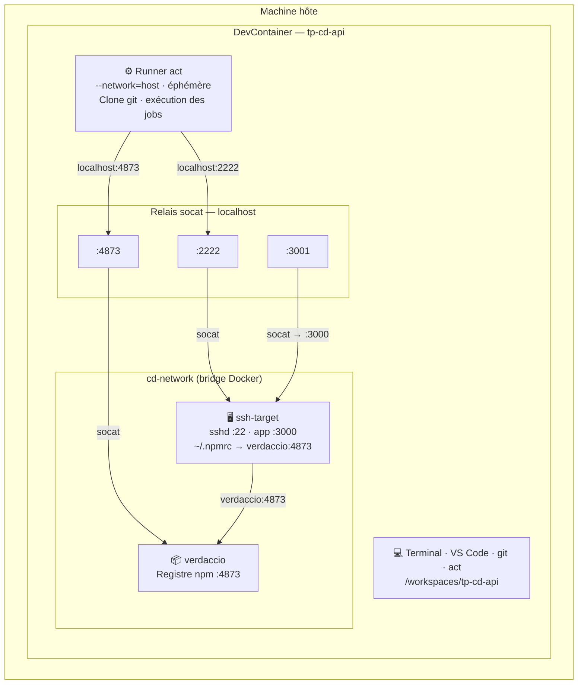
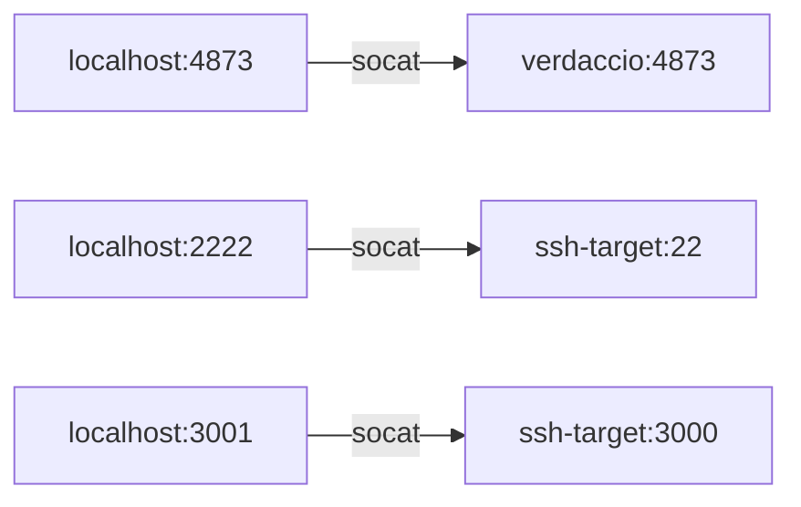

# Architecture — Vue d'ensemble des environnements

Ce TP fait interagir **4 environnements distincts**. Comprendre leurs frontières évite beaucoup de confusion.

---

## Diagramme général

---

## Tableau récapitulatif des services

| Service | Où tourne-t-il ? | Port interne | Accessible depuis le DevContainer | Accessible depuis un runner act |
|---|---|---|---|---|
| Verdaccio | Container Docker `verdaccio` | `4873` | `localhost:4873` (via socat) | `localhost:4873` (via socat, --network=host) |
| SSH-target | Container Docker `ssh-target` | `22` (SSH), `3000` (app) | `localhost:2222` / `localhost:3001` (via socat) | `localhost:2222` / `localhost:3001` (via socat) |
| App NestJS | Dans ssh-target (géré par pm2) | `3000` | `localhost:3001` (via socat) | `localhost:3001` (via socat) |

---

## Le réseau `cd-network`

Verdaccio et ssh-target sont connectés via un **réseau bridge Docker** nommé `cd-network`. Sur ce réseau, les containers se voient par leur nom de service :

- ssh-target peut joindre Verdaccio via `http://verdaccio:4873` (c'est pourquoi `~/.npmrc` sur ssh-target utilise cette adresse)
- Le DevContainer est également connecté à `cd-network` (ajouté dans `setup.sh`)

Le runner `act` utilise `--network=host` (configuré dans `.actrc`). Il partage donc l'interface réseau du DevContainer et peut atteindre `localhost:4873` et `localhost:2222` via les relais socat.

---

## Le rôle des relais socat

Le DevContainer expose les services Docker via des processus `socat` qui font le pont entre `localhost` et les containers :

Ces processus sont démarrés par `setup.sh` au lancement du DevContainer. S'ils s'arrêtent (mise en veille, redémarrage), utilisez `bin/check-relays.sh` pour les relancer.

---

## Documents complémentaires

| Document | Contenu |
|---|---|
| [git-et-runners.md](git-et-runners.md) | Isolation git des runners, workflow de vraie montée de version |
| [ssh-et-secrets.md](ssh-et-secrets.md) | Keypair SSH, secrets `act`, `appleboy/ssh-action` |
| [verdaccio-et-npm.md](verdaccio-et-npm.md) | Verdaccio, relais socat, `npm unpublish`, `check-relays.sh` |
