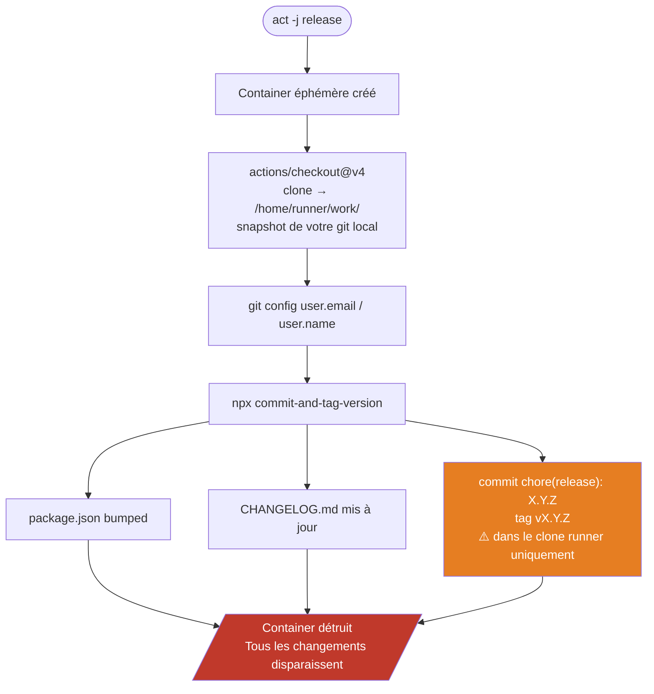
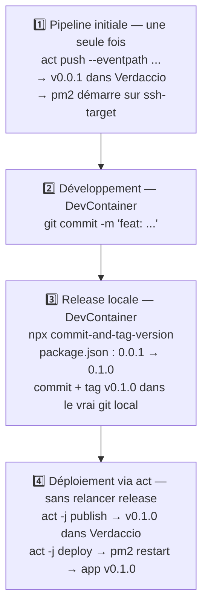

# Git et runners — Isolation et workflow de montée de version

---

## Pourquoi le commit et le tag du job `release` ne sont pas visibles dans le DevContainer

C'est **la source de confusion numéro 1** dans ce TP.

Quand vous lancez `act -j release`, voici ce qui se passe réellement :



**Votre dépôt git dans le DevContainer n'est jamais touché.** Le runner ne fait que cloner — il ne pousse rien en retour.

Conséquence pratique :
- `git tag` dans votre terminal → aucun tag créé par le runner
- `cat package.json | grep version` → toujours la version d'origine
- `git log` → le commit `chore(release):` n'existe pas

C'est le comportement **attendu et normal** dans un contexte CI local avec `act`. En vrai GitHub Actions, le runner pousserait le tag et le commit vers le dépôt distant. Ici, il n'y a pas de remote configuré dans le runner.

---

## Comment faire une vraie montée de version

Pour simuler un vrai cycle CD — une version de référence déjà déployée, puis une mise à jour — il faut **d'abord établir un état "production" initial**, puis bumper la version **localement** dans le DevContainer.

### Étape 1 — Déployer une version de référence

Lancez la pipeline complète pour déployer la version actuelle (ex: `0.0.1`) :

```bash
act push --eventpath <(echo '{"ref":"refs/heads/main"}')
```

Après ce run :
- `0.0.1` est publiée dans Verdaccio
- pm2 tourne sur ssh-target avec l'app `0.0.1`

C'est votre "état production initial". Sans cette étape, `pm2 restart tp-cd-api` dans le job `deploy` échouera (pas de processus connu de pm2) et tombera sur `pm2 start` — ça fonctionne, mais ce n'est pas représentatif d'une vraie mise à jour.

### Étape 2 — Faire des commits conventionnels

Modifiez du code, puis committez en suivant la convention [Conventional Commits](https://www.conventionalcommits.org/) :

```bash
git commit -m "fix: correct task update response code"
# ou
git commit -m "feat: add task filtering by status"
# ou (breaking change → bump majeur)
git commit -m "feat!: redesign task entity structure"
```

La convention détermine le type de bump :
- `fix:` → patch (`0.0.1` → `0.0.2`)
- `feat:` → minor (`0.0.1` → `0.1.0`)
- `feat!:` ou `BREAKING CHANGE:` → major (`0.0.1` → `1.0.0`)

### Étape 3 — Bumper la version localement

Exécutez `commit-and-tag-version` **dans votre DevContainer**, pas dans un runner :

```bash
npx commit-and-tag-version
```

Cette commande :
1. Analyse l'historique git depuis le dernier tag
2. Détermine le type de bump (patch/minor/major)
3. Modifie `package.json` avec la nouvelle version
4. Génère/met à jour `CHANGELOG.md`
5. Crée un commit `chore(release): X.Y.Z`
6. Crée un tag `vX.Y.Z`

**Tout cela dans votre dépôt git local réel** — pas dans un runner éphémère.

Vérifiez le résultat :

```bash
git tag
# v0.0.1   ← créé lors de la première pipeline
# v0.1.0   ← créé par votre release locale

grep '"version"' package.json
# "version": "0.1.0"
```

### Étape 4 — Publier et déployer la nouvelle version

Maintenant que `package.json` indique `0.1.0`, les jobs `publish` et `deploy` vont travailler avec cette version.

```bash
# Publier la nouvelle version dans Verdaccio
act -j publish

# Déployer sur ssh-target (pm2 restart → mise à jour effective)
act -j deploy
```

> ⚠️ **Ne relancez pas le job `release` à cette étape.**
>
> Si vous lancez `act -j release` après avoir fait un release local, le runner clonera votre dépôt (qui contient déjà le tag `v0.1.0`), et `commit-and-tag-version` verra ce tag et créera un nouveau bump `v0.1.1` — ce que vous ne voulez pas.
>
> La règle est simple : **le release local remplace le job `release`**. Lancez directement `publish` puis `deploy`.

### Récapitulatif du cycle complet



---

## Vérifier que la montée de version a bien eu lieu

```bash
# Version publiée dans Verdaccio
npm view tp-cd-api --registry http://localhost:4873

# Processus pm2 sur le serveur
ssh -p 2222 deployer@localhost "pm2 list"

# Smoke test manuel
curl http://localhost:3001/health
```
